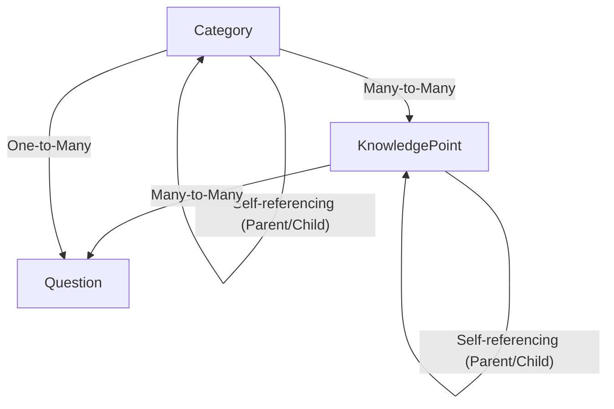
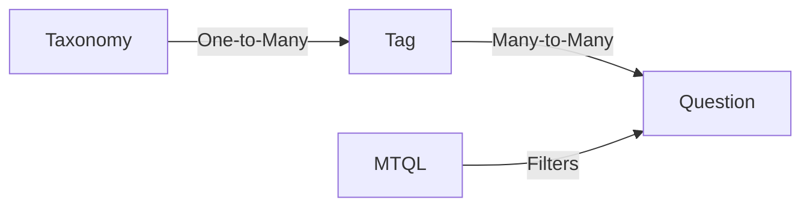
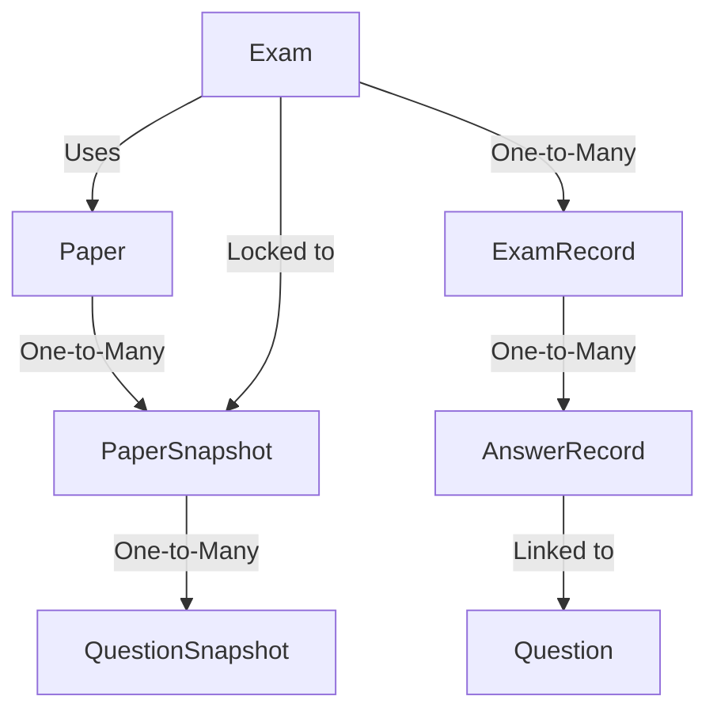

# WeChatExam - A sample project

[](https://gitlab.aiursoft.com/aiursoft/weChatExam/-/blob/master/LICENSE)
[](https://gitlab.aiursoft.com/aiursoft/weChatExam/-/pipelines)
[](https://gitlab.aiursoft.com/aiursoft/weChatExam/-/pipelines)
[](https://manhours.aiursoft.com/r/gitlab.aiursoft.com/aiursoft/weChatExam.html)
[](https://weChatExam.aiursoft.com)
[](https://hub.docker.com/r/aiursoft/wechatexam)

WeChatExam is a sample project.


Default user name is `admin@default.com` and default password is `admin123`.

## Projects using Aiursoft WeChatExam

* [Stathub](https://gitlab.aiursoft.com/aiursoft/stathub)
* [MarkToHtml](https://gitlab.aiursoft.com/aiursoft/marktohtml)
* [MusicTools](https://gitlab.aiursoft.com/aiursoft/musictools)
* [AnduinOS Home](https://gitlab.aiursoft.com/anduin/AnduinOS-Home)
* [Manhours](https://gitlab.aiursoft.com/aiursoft/manhours)
* [Tracer](https://gitlab.aiursoft.com/aiursoft/tracer)
* [Warp](https://gitlab.aiursoft.com/aiursoft/warp)

## Try

Try a running WeChatExam [here](https://weChatExam.aiursoft.com).

## Run in Ubuntu

The following script will install\update this app on your Ubuntu server. Supports Ubuntu 25.04.

On your Ubuntu server, run the following command:

```bash
curl -sL https://gitlab.aiursoft.com/aiursoft/weChatExam/-/raw/master/install.sh | sudo bash
```

Of course it is suggested that append a custom port number to the command:

```bash
curl -sL https://gitlab.aiursoft.com/aiursoft/weChatExam/-/raw/master/install.sh | sudo bash -s 8080
```

It will install the app as a systemd service, and start it automatically. Binary files will be located at `/opt/apps`. Service files will be located at `/etc/systemd/system`.

## Run manually

Requirements about how to run

1. Install [.NET 10 SDK](http://dot.net/) and [Node.js](https://nodejs.org/).
2. Execute `npm install` at `wwwroot` folder to install the dependencies.
3. Execute `dotnet run` to run the app.
4. Use your browser to view [http://localhost:5000](http://localhost:5000).

## Run in Microsoft Visual Studio

1. Open the `.sln` file in the project path.
2. Press `F5` to run the app.

## Run in Docker

First, install Docker [here](https://docs.docker.com/get-docker/).

Then run the following commands in a Linux shell:

```bash
image=aiursoft/weChatExam
appName=weChatExam
sudo docker pull $image
sudo docker run -d --name $appName --restart unless-stopped -p 5000:5000 -v /var/www/$appName:/data $image
```

That will start a web server at `http://localhost:5000` and you can test the app.

The docker image has the following context:

| Properties  | Value                           |
|-------------|---------------------------------|
| Image       | aiursoft/weChatExam               |
| Ports       | 5000                            |
| Binary path | /app                            |
| Data path   | /data                           |
| Config path | /data/appsettings.json          |

## How to contribute

There are many ways to contribute to the project: logging bugs, submitting pull requests, reporting issues, and creating suggestions.

Even if you with push rights on the repository, you should create a personal fork and create feature branches there when you need them. This keeps the main repository clean and your workflow cruft out of sight.

We're also interested in your feedback on the future of this project. You can submit a suggestion or feature request through the issue tracker. To make this process more effective, we're asking that these include more information to help define them more clearly.

## Data Structure and MTQL

The project follows a complex data structure to support various exam scenarios. Below are the key components and their relationships.

### 1. Content Organization (Categories, Knowledge Points, and Questions)

The system organizes content using a hierarchical structure for both Categories and Knowledge Points.



- **Category**: A hierarchical tree to organize questions and knowledge points. A question belongs to one category but can be related to multiple knowledge points.
- **Knowledge Point**: A hierarchical tree representing specific educational units. Questions are linked to knowledge points to track what a question is testing.

### 2. Tagging System and MTQL (MarkToQueryLanguage)

The system uses a flexible tagging system grouped by Taxonomies.



- **Taxonomy**: Groups tags into different systems (e.g., "Difficulty", "Source", "Year").
- **Tag**: Individual labels applied to questions.
- **MTQL (MarkToQueryLanguage)**: A Domain Specific Language (DSL) used to query questions by tags. It supports boolean logic like `(tag1 || tag2) && not tag3`. This allows for highly flexible question selection when building papers or exams.

### 3. Paper and Exam System

The system distinguishes between Paper templates and actual Exam instances, using snapshots for content freezing.



- **Paper**: A template for an exam, containing a set of questions.
- **PaperSnapshot**: A frozen version of a Paper. When an exam starts, it uses a snapshot to ensure all students see the same questions even if the Paper template is updated later.
- **QuestionSnapshot**: A frozen version of a Question within a PaperSnapshot.
- **Exam**: An actual instance of an assessment with start/end times.
- **ExamRecord**: A student's attempt at an exam.
- **AnswerRecord**: A student's individual answer to a question in an exam attempt.
